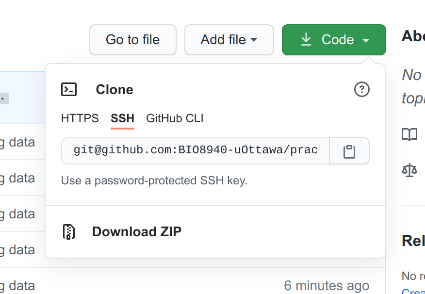

# Données pour BIO4558 / Data for BIO4158 practicals

## Français

Ce répertoire contient l'ensemble des jeu de données utilisé dans les laboratoires et travaux du cours **BIO4558 Biostatisques appliquées**. Vous trouverez aussi l'ensemble du code `R` utilisé dans le manuel de laboratoire dans le dossier `R_code`.

La manière la plus simple de télécharger l'ensemble des fichiers et de cliquer sur le bouton vert `code` et de choisir *Download ZIP*.

Après avoir téléchargé le fichier *.zip*, il faut l'extraire à l'endroit de votre choix. Ma recommendation est de placer ce dossier dans le dossier de travail que vous utilisez pour sauvegarder vos script de code `R` et de le renommer avec le nom `data`. L'ensemble du code dans le manuel assume que les fichiers de données sont dans un dossier `data` dans le répertoire de travail de `R`.

## English

This repository has all datasets used in the practicals of the course **BIO4158 Applied Biostatistics**. In addition, extra examples as well as all `R` code used in the book are provided in *.R* files.

The easiest way to download the dat is simply to click on the big green `code` button and select *Download ZIP*.

After downloading the *.zip* file, extract it to the location of your choice. My recommendation is to extract it in a folder where you will be saving all your `.R` and `.Rmd` scripts for the course. After extracting, rename the extracted folder from `data_code-main` to `data`.